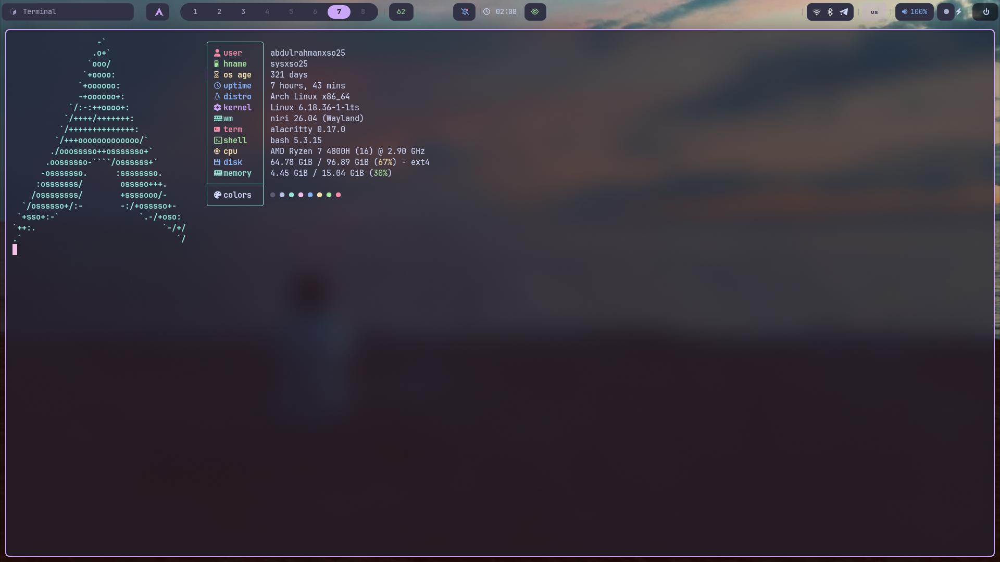
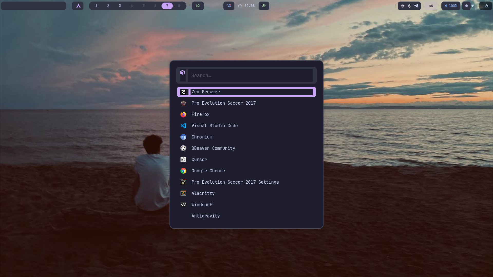
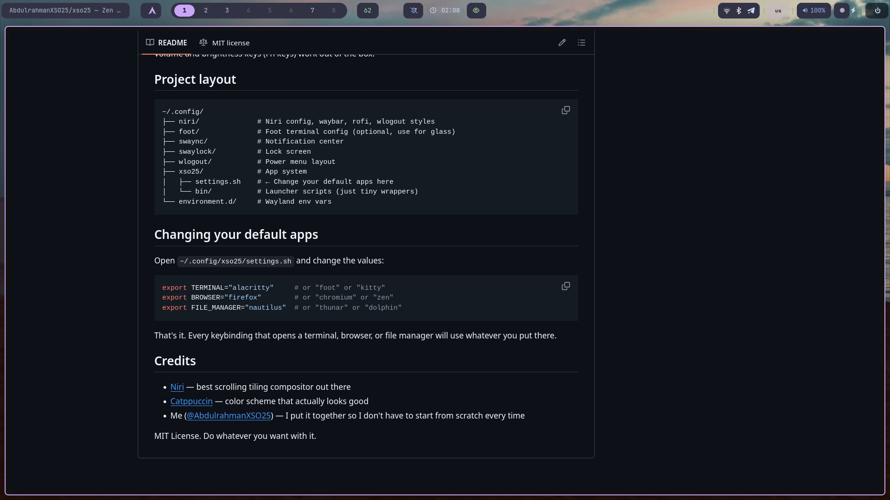
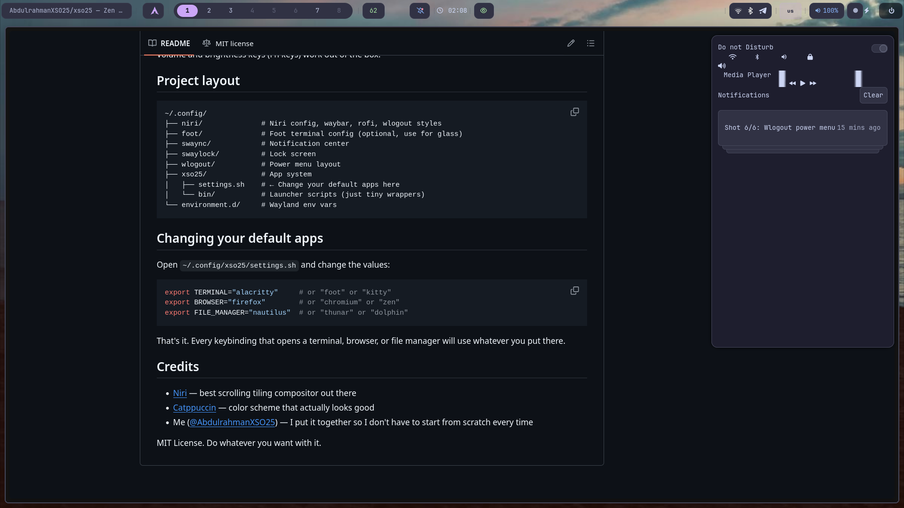
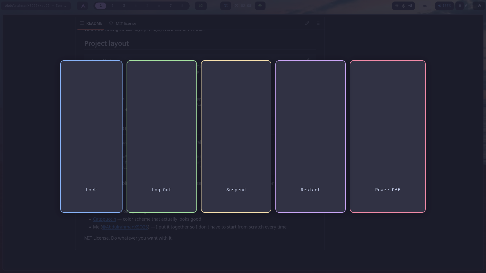

# xso25

A Catppuccin Mocha rice for the [Niri](https://github.com/YaLTeR/niri) Wayland compositor.


## Install

```bash
bash <(curl -s https://raw.githubusercontent.com/AbdulrahmanXSO25/xso25/main/install.sh)
```

Works on Arch Linux and Fedora 40+. The installer detects your GPU, installs drivers, sets up SDDM, and applies the configs. More details in [docs/INSTALL.md](docs/INSTALL.md).

Fedora users see [docs/FEDORA.md](docs/FEDORA.md).  
Coming from GNOME? See [docs/MIGRATE-FROM-GNOME.md](docs/MIGRATE-FROM-GNOME.md).

## Screenshots

|  |  |
|----------------------------------------|----------------------------------------|
|  |  |
|  |  |

## Keybindings

| Keys | Action |
|------|--------|
| `Mod + Return` | Terminal |
| `Mod + Space` | App launcher |
| `Mod + B` | Browser |
| `Mod + E` | File manager |
| `Mod + Q` | Close window |
| `Mod + F` | Fullscreen |
| `Mod + V` | Toggle floating |
| `Mod + H/J/K/L` | Move focus |
| `Mod + 1` through `Mod + 6` | Switch workspace |
| `Mod + Shift + 1` through `0` | Move window to workspace |
| `Mod + R` | Cycle column widths |
| `Mod + U/I` | Previous / next workspace |
| `Mod + Escape` | Power menu |
| `Super + Alt + L` | Lock screen |
| `Print` | Screenshot |

## Changing default apps

```bash
# ~/.config/xso25/settings.sh
export TERMINAL="alacritty"
export BROWSER="firefox"
export FILE_MANAGER="thunar"
```

## Layout

```
~/.config/
├── niri/         # Compositor config, waybar, rofi, wlogout
├── foot/         # Glass terminal
├── swaync/       # Notifications
├── swaylock/     # Lock screen
├── wlogout/      # Power menu
├── xso25/        # App system
│   ├── settings.sh
│   └── bin/
└── environment.d/
```

## License

MIT.
